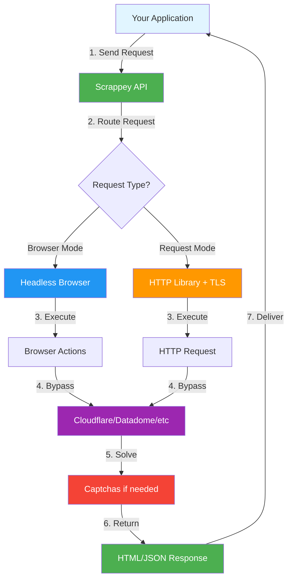

# Scrappey - Official Python Wrapper

[](https://badge.fury.io/py/scrappey)
[](https://www.python.org/downloads/)
[](https://opensource.org/licenses/MIT)

Official Python wrapper for [Scrappey.com](https://scrappey.com) - Web scraping API with automatic Cloudflare bypass, antibot solving, captcha solving, and browser automation.

## Features

- **Cloudflare Bypass** - Automatically bypass Cloudflare protection
- **Antibot Solving** - Handle Datadome, PerimeterX, Kasada, Akamai, and more
- **Captcha Solving** - Automatic solving for reCAPTCHA, hCaptcha, Turnstile
- **Browser Automation** - Full browser control with actions like click, type, scroll
- **Session Management** - Maintain cookies and state across requests
- **Proxy Support** - Built-in proxy rotation with country selection
- **Async Support** - Both sync and async clients included
- **Type Hints** - Full type annotations for IDE support and AI assistants
- **Drop-in Replacement** - Use as a replacement for the `requests` library

## Pricing

Scrappey offers the best value for web scraping with JavaScript rendering and residential proxies:

| Feature | Scrappey | ZenRows | ScrapingBee | Scrapfly |
|---------|----------|---------|-------------|----------|
| **Price per 1K Scrapes**<br/>(JS Render + Residential Proxies) | **€1** | $25 | $25 | $187 |
| **Concurrent Requests**<br/>(Simultaneous scraping) | **200** | 10 | 5 | 5 |
| **Browser Automation**<br/>(Actions and interactions) | **30+ Actions** | Basic | Basic | Basic |
| **Billing Model**<br/>(Payment flexibility) | **Pay-as-you-go** | Monthly | Monthly | Monthly |
| **Success Rate**<br/>(Successful scrapes) | **95%** | 95% | 95% | 95% |

**Why Scrappey?**
- 🚀 **25x cheaper** than competitors for JS rendering
- ⚡ **20x more concurrent requests** (200 vs 5-10)
- 🎯 **30+ browser actions** vs basic automation
- 💰 **Pay-as-you-go** - no monthly commitments
- ✅ **Same 95% success rate** as premium services

## How It Works



**Request Flow:**
1. **Your application** sends a request to Scrappey API
2. **Scrappey routes** to browser or HTTP mode based on `requestType`
3. **Browser/HTTP engine** executes the request with fingerprinting
4. **Antibot bypass** automatically handles Cloudflare, Datadome, etc.
5. **Captcha solving** if needed (reCAPTCHA, hCaptcha, Turnstile)
6. **Response returned** with HTML, JSON, or extracted data
7. **Delivered** back to your application

## Installation

```bash
pip install scrappey
```

## API Key Setup

You can provide your Scrappey API key in two ways:

### Option 1: Environment Variable (Recommended)

Set the `SCRAPPEY_API_KEY` environment variable:

**Windows (PowerShell):**
```powershell
# Temporary (current session only)
$env:SCRAPPEY_API_KEY = "your_api_key_here"

# Permanent (user-level)
[System.Environment]::SetEnvironmentVariable('SCRAPPEY_API_KEY', 'your_api_key_here', [System.EnvironmentVariableTarget]::User)
```

**Windows (Command Prompt):**
```cmd
# Temporary (current session only)
set SCRAPPEY_API_KEY=your_api_key_here

# Permanent (user-level)
setx SCRAPPEY_API_KEY "your_api_key_here"
```

**Linux/macOS (Bash/Zsh):**
```bash
# Temporary (current session only)
export SCRAPPEY_API_KEY="your_api_key_here"

# Permanent (add to ~/.bashrc or ~/.zshrc)
echo 'export SCRAPPEY_API_KEY="your_api_key_here"' >> ~/.bashrc
source ~/.bashrc
```

**Linux/macOS (Fish):**
```fish
# Temporary (current session only)
set -x SCRAPPEY_API_KEY "your_api_key_here"

# Permanent (add to ~/.config/fish/config.fish)
echo 'set -x SCRAPPEY_API_KEY "your_api_key_here"' >> ~/.config/fish/config.fish
```

### Option 2: Pass Directly in Code

```python
from scrappey import Scrappey

scrappey = Scrappey(api_key="your_api_key_here")
```

> **Note**: Get your API key from [https://app.scrappey.com](https://app.scrappey.com)

## Quick Start

```python
from scrappey import Scrappey

# Initialize with your API key
scrappey = Scrappey(api_key="YOUR_API_KEY")

# Simple GET request
result = scrappey.get(url="https://example.com")
print(result["solution"]["response"])

# Don't forget to close the client when done
scrappey.close()
```

Or use as a context manager:

```python
from scrappey import Scrappey

with Scrappey(api_key="YOUR_API_KEY") as scrappey:
    result = scrappey.get(url="https://example.com")
    print(result["solution"]["statusCode"])
```

## Request Types

Scrappey supports two request modes with different trade-offs:

| Mode | Description | Cost | Speed |
|------|-------------|------|-------|
| `browser` | Headless browser (default) | 1 balance | Slower, more powerful |
| `request` | HTTP library with TLS | 0.2 balance | Faster, cheaper |

### Browser Mode (Default)

Uses a real headless browser. Best for:
- Sites with JavaScript rendering
- Cloudflare, Datadome, and other antibot protection
- Browser actions and screenshots

```python
# Browser mode is the default
result = scrappey.get(url="https://protected-site.com")
```

### Request Mode

Uses an HTTP library with TLS fingerprinting. Best for:
- Simple API calls
- High-volume scraping
- When you need speed and low cost

```python
# Request mode - 5x cheaper and faster
result = scrappey.get(url="https://api.example.com", requestType="request")

# Works with all HTTP methods
result = scrappey.post(
    url="https://api.example.com/data",
    postData={"key": "value"},
    requestType="request",
)
```

## Async Usage

```python
import asyncio
from scrappey import AsyncScrappey

async def main():
    async with AsyncScrappey(api_key="YOUR_API_KEY") as scrappey:
        # Parallel requests
        urls = ["https://example1.com", "https://example2.com"]
        results = await asyncio.gather(*[
            scrappey.get(url=url) for url in urls
        ])
        for result in results:
            print(result["solution"]["statusCode"])

asyncio.run(main())
```

## Drop-in Replacement for `requests`

Scrappey provides a **drop-in replacement** for the popular `requests` library. Simply change your import and your existing code will work with Scrappey's Cloudflare bypass and antibot capabilities!

### Migration

```python
# Before (using requests)
import requests

response = requests.get("https://example.com")
print(response.text)

# After (using Scrappey) - just change the import!
from scrappey import requests

response = requests.get("https://example.com")
print(response.text)
```

That's it! Your code now uses Scrappey for automatic Cloudflare bypass.

> **Note**: Set the `SCRAPPEY_API_KEY` environment variable with your API key.

### Response Object

The Response object works exactly like `requests.Response`:

```python
from scrappey import requests

response = requests.get("https://httpbin.org/get")

# All standard attributes
print(response.status_code)    # 200
print(response.ok)             # True
print(response.text)           # Response body as text
print(response.content)        # Response body as bytes
print(response.headers)        # Response headers
print(response.cookies)        # Response cookies
print(response.url)            # Final URL
print(response.elapsed)        # Time elapsed

# Methods
data = response.json()         # Parse JSON
response.raise_for_status()    # Raise on 4xx/5xx
```

### Sessions

Sessions maintain cookies and headers across requests:

```python
from scrappey import requests

session = requests.Session()

try:
    # Login
    session.post("https://example.com/login", data={"user": "test"})

    # Subsequent requests include cookies from login
    response = session.get("https://example.com/dashboard")

    # Session-level headers
    session.headers.update({"Authorization": "Bearer token"})
finally:
    session.close()  # Clean up Scrappey session
```

Or use as a context manager:

```python
from scrappey import requests

with requests.Session() as session:
    session.get("https://example.com")
    # Session automatically closed when exiting
```

### Supported Parameters

| Parameter | Supported | Notes |
|-----------|-----------|-------|
| `params` | Yes | Query parameters |
| `data` | Yes | Form data |
| `json` | Yes | JSON data |
| `headers` | Yes | Custom headers |
| `cookies` | Yes | Request cookies |
| `timeout` | Yes | Request timeout |
| `proxies` | Yes | Proxy configuration |
| `request_type` | Yes | "browser" (default) or "request" (faster) |
| `allow_redirects` | Warn | Handled by browser |
| `verify` | Warn | SSL handled by service |
| `stream` | Warn | Not supported |
| `files` | Warn | Not supported |
| `auth` | Warn | Use headers instead |

### Why Use This?

Sites protected by Cloudflare, Datadome, PerimeterX, and other antibots will **just work**:

```python
from scrappey import requests

# This would fail with regular requests, but works with Scrappey!
response = requests.get("https://nowsecure.nl/")  # CF-protected
print(response.status_code)  # 200
```

## Examples

### Cloudflare Bypass

```python
result = scrappey.get(
    url="https://protected-site.com"
)

if result["data"] == "success":
    print("Successfully bypassed Cloudflare!")
    print(result["solution"]["response"])
```

### Session Management

Sessions persist cookies and browser state across requests:

```python
# Create a session
session = scrappey.create_session(proxyCountry="UnitedStates")
session_id = session["session"]

try:
    # All requests with this session share cookies
    scrappey.get(url="https://example.com/login", session=session_id)
    scrappey.get(url="https://example.com/dashboard", session=session_id)
finally:
    # Clean up when done
    scrappey.destroy_session(session_id)
```

### Browser Automation

```python
result = scrappey.browser_action(
    url="https://example.com/login",
    actions=[
        {"type": "wait_for_selector", "cssSelector": "#login-form"},
        {"type": "type", "cssSelector": "#email", "text": "user@example.com"},
        {"type": "type", "cssSelector": "#password", "text": "password123"},
        {"type": "click", "cssSelector": "#submit-btn", "waitForSelector": ".dashboard"},
        {"type": "execute_js", "code": "document.querySelector('.user-name').innerText"},
    ],
)

# Get JavaScript return values
print(result["solution"]["javascriptReturn"])
```

### POST Requests

```python
# Form data
result = scrappey.post(
    url="https://httpbin.org/post",
    postData="username=user&password=pass",
)

# JSON data
result = scrappey.post(
    url="https://api.example.com/data",
    postData={"key": "value"},
    customHeaders={"Content-Type": "application/json"},
)
```

### Automatic Captcha Solving

```python
result = scrappey.get(
    url="https://site-with-captcha.com",
    automaticallySolveCaptchas=True
)
```

### Screenshot Capture

```python
result = scrappey.screenshot(
    url="https://example.com",
    width=1920,
    height=1080,
)

# Save screenshot
import base64
with open("screenshot.png", "wb") as f:
    f.write(base64.b64decode(result["solution"]["screenshot"]))
```

### Using Request Builder Output

Copy directly from the [Request Builder](https://app.scrappey.com/#/builder):

```python
result = scrappey.request({
    "cmd": "request.get",
    "url": "https://example.com",
    "browserActions": [
        {"type": "wait", "wait": 2000},
        {"type": "scroll", "cssSelector": "footer"}
    ],
    "screenshot": True
})
```

## API Reference

### Scrappey Client

```python
Scrappey(
    api_key: str,                    # Your API key (required)
    base_url: str = "...",           # API URL (optional)
    timeout: float = 300,            # Request timeout in seconds
)
```

### Methods

| Method | Description |
|--------|-------------|
| `get(url, **options)` | Perform GET request |
| `post(url, postData, **options)` | Perform POST request |
| `put(url, postData, **options)` | Perform PUT request |
| `delete(url, **options)` | Perform DELETE request |
| `patch(url, postData, **options)` | Perform PATCH request |
| `request(options)` | Send request with full options dict |
| `create_session(**options)` | Create a new session |
| `destroy_session(session)` | Destroy a session |
| `browser_action(url, actions, **options)` | Execute browser actions |
| `screenshot(url, **options)` | Capture screenshot |

### Common Options

| Option | Type | Description |
|--------|------|-------------|
| `requestType` | str | "browser" (default) or "request" (faster, cheaper) |
| `session` | str | Session ID for state persistence |
| `proxy` | str | Custom proxy (http://user:pass@ip:port) |
| `proxyCountry` | str | Proxy country (e.g., "UnitedStates") |
| `premiumProxy` | bool | Use premium residential proxies |
| `mobileProxy` | bool | Use mobile carrier proxies |
| `cloudflareBypass` | bool | Enable Cloudflare bypass |
| `datadomeBypass` | bool | Enable Datadome bypass |
| `kasadaBypass` | bool | Enable Kasada bypass |
| `automaticallySolveCaptchas` | bool | Auto-solve captchas |
| `browserActions` | list | Browser automation actions |
| `screenshot` | bool | Capture screenshot |
| `cssSelector` | str | Extract content by CSS selector |
| `customHeaders` | dict | Custom HTTP headers |

### Response Structure

```python
{
    "solution": {
        "verified": True,
        "response": "<html>...</html>",
        "statusCode": 200,
        "currentUrl": "https://example.com",
        "cookies": [...],
        "cookieString": "session=abc; token=xyz",
        "userAgent": "Mozilla/5.0...",
        "screenshot": "base64...",
        "javascriptReturn": [...],
    },
    "timeElapsed": 1234,
    "data": "success",  # or "error"
    "session": "session-id",
    "error": "error message if failed"
}
```

## Multi-Language Examples

Examples are provided for:

- **Python** - `examples/python/`
- **Node.js** - `examples/nodejs/`
- **TypeScript** - `examples/typescript/`
- **Go** - `examples/go/`
- **Java** - `examples/java/`
- **C#** - `examples/csharp/`
- **PHP** - `examples/php/`
- **Ruby** - `examples/ruby/`
- **Rust** - `examples/rust/`
- **Kotlin** - `examples/kotlin/`
- **cURL** - `examples/curl/`

## Error Handling

The API returns errors in the response body. Check the `data` field:

```python
result = scrappey.get(url="https://example.com")

if result["data"] == "success":
    html = result["solution"]["response"]
else:
    error = result.get("error", "Unknown error")
    print(f"Request failed: {error}")
```

Client-side errors raise exceptions:

```python
from scrappey import (
    ScrappeyError,
    ScrappeyConnectionError,
    ScrappeyTimeoutError,
    ScrappeyAuthenticationError,
)

try:
    result = scrappey.get(url="https://example.com")
except ScrappeyConnectionError:
    print("Could not connect to API")
except ScrappeyTimeoutError:
    print("Request timed out")
except ScrappeyAuthenticationError:
    print("Invalid API key")
except ScrappeyError as e:
    print(f"API error: {e}")
```

## Pricing & Plans

Visit [https://scrappey.com/pricing](https://scrappey.com/pricing) for detailed pricing information and plans.

**Key Benefits:**
- 💰 **Pay-as-you-go** - Only pay for what you use
- 🎯 **No monthly commitments** - Cancel anytime
- 📊 **Transparent pricing** - See costs before you scrape
- 🚀 **Volume discounts** - Better rates for high-volume users

## Links

- **Website**: https://scrappey.com
- **Documentation**: https://wiki.scrappey.com/getting-started
- **Request Builder**: https://app.scrappey.com/#/builder
- **API Reference**: https://wiki.scrappey.com/api-reference
- **Pricing**: https://scrappey.com/pricing
- **GitHub**: https://github.com/pim97/scrappey-wrapper-python

## License

MIT License - see [LICENSE](LICENSE) for details.

## Disclaimer

Please ensure that your web scraping activities comply with the website's terms of service and legal regulations. Scrappey is not responsible for any misuse or unethical use of the library. Use responsibly and respect website policies.
